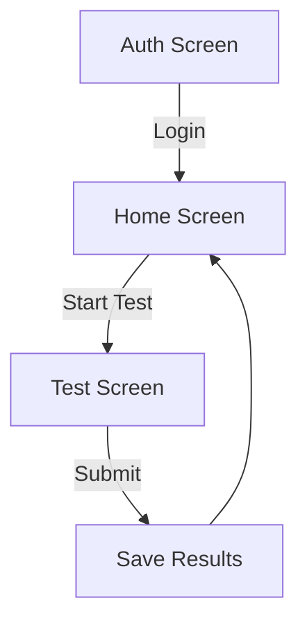

# K53 Simulation App Documentation

## Security Notice
⚠️ **Important**: This project contains exposed Supabase credentials for development convenience only. In a production environment:
- Never commit API keys or credentials to version control
- Use environment variables or secure secret management
- Restrict database permissions
- Rotate keys regularly

The current keys are intentionally exposed to simplify setup for evaluators, but this should never be done in real applications.

## Overview
A Flutter application for practicing South African K53 driving test questions with:
- User authentication via Supabase
- Test session tracking with daily attempt limits
- Progress sharing via WhatsApp/social media
- Complete test history

## Architecture

### Main Components
```
lib/
├── main.dart            # App entry point, theme config
├── auth_service.dart    # Authentication logic
├── models/
│   ├── question.dart    # Question data model
│   └── test_session.dart # Test session tracking
├── screens/
│   ├── auth_screen.dart # Login/registration
│   ├── home_screen.dart # Main dashboard
│   └── test_screen.dart # Test interface
└── services/
    ├── supabase_service.dart # Database operations
    └── share_tracker.dart   # Progress sharing
```

## Key Features

### 1. Authentication System
- Email/password login via Supabase
- Session persistence
- Logout functionality
- Protected routes

### 2. Test System
- 3 daily test attempts limit
- Random question selection
- Automatic scoring
- Session saving to Supabase
- Visual progress indicators

### 3. Data Flow


## Models

### Question Model
- `id`: String - Unique identifier
- `text`: String - Question content
- `options`: List<String> - Answer choices
- `correctIndex`: int - Position of correct answer
- `imagePath`: String? - Optional visual reference

### TestSession Model
- `userId`: String - Owner reference
- `startTime`: DateTime - Test timestamp  
- `questions`: List<Question> - Questions asked
- `userAnswers`: Map<String, int> - User responses
- `score`: int - Calculated correct answers
- `percentage`: double - Score percentage

## Services

### SupabaseService
Key Methods:
- `getQuestions()`: Future<List<Question>> - Fetches test bank
- `saveTestSession(TestSession)`: Future<void> - Stores results
- `getUserAttemptsToday(userId, date)`: Future<int> - Checks daily limits
- `getUserTestHistory(userId)`: Stream<List<Map>> - Retrieves past tests

### WhatsAppShareService
Features:
- Shares test results via:
  - WhatsApp direct message
  - Other social platforms
- Includes score and test details
- Uses share_plus package

## Screens

### HomeScreen
Components:
- Start new test button (with attempts counter)
- Test history list (cards with scores/dates)
- Progress sharing button
- Logout option
- Daily attempts display

### TestScreen
Features:
- Question display with optional image
- Multiple choice interface
- Progress tracking (X/Y questions)
- Automatic scoring on completion
- Results dialog with share option

## Configuration

### Theme Settings
- Primary Color: Blue (#1565C0)
- Secondary Color: Grey (#EEEEEE)  
- Card Style:
  - 12px border radius
  - 2px elevation
  - 16px padding
- Button Styles:
  - Primary: Filled blue
  - Secondary: Outlined grey
  - Consistent sizing/padding

### Environment Requirements
- Flutter 3.0+
- Supabase configuration
- Dependencies:
  - supabase_flutter
  - share_plus
  - url_launcher
  - provider

## Setup Instructions
1. Clone repository
2. Run `flutter pub get`
3. Configure Supabase keys in main.dart
4. Run `flutter run`
5. For production:
   - Move keys to environment variables
   - Set proper database permissions
   - Enable row-level security
